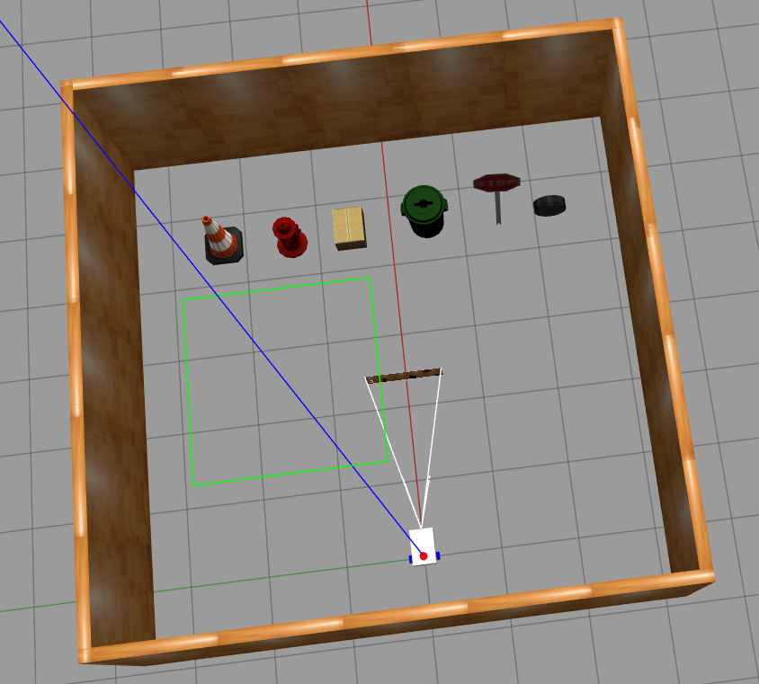
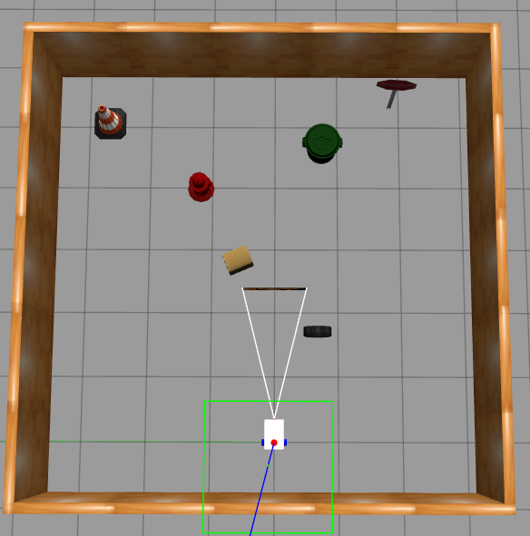
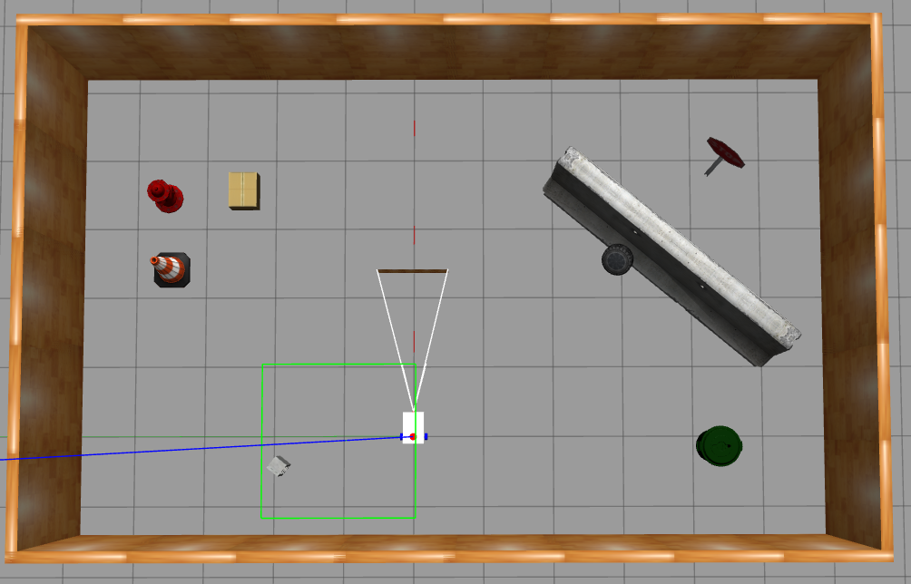

# AR Project

This repository contains a simulation setup for a custom robot in Gazebo using SLAM Toolbox, Nav2, and RViz2. The robot can be launched into different worlds, build maps using SLAM, and navigate using Nav2.

## Robot Description

The robot is a differential drive mobile platform with two rear wheels and one omnidirectional front wheel for passive balancing. It is equipped with the following sensors:

- A 2D LiDAR for mapping and obstacle detection
- An RGB camera for visual information
- A depth camera for 3D perception and distance estimation

## Project Structure

- `config/` — Configuration files for SLAM, controllers, RViz, and navigation.
- `description/` — URDF/XACRO files describing the robot model.
- `launch/` — Launch scripts for simulation, SLAM, navigation, and visualization.
- `maps/` — Pre-built maps corresponding to each world.
- `worlds/` — Gazebo world files for testing simulation.

## How to Run the Simulation

### 1. Launch Gazebo Simulation with a Specific World
Replace `<n>` with the world number (1, 2, or 3):
```bash
ros2 launch ar_project launch_sim.launch.py world:=./src/ar_project/worlds/test_<n>.world
```

### 2. Launch SLAM Toolbox

Before launching, update the map_file_name field in config/mapper_params_online_async.yaml:

```yaml
map_file_name: "home/<user>/<path_to_ROS_workspace>/src/ar_project/maps/test_map_<n>/test_world_<n>_map_serial"
```

Then run:

```bash
ros2 launch slam_toolbox online_async_launch.py \
    slam_params_file:=./src/ar_project/config/mapper_params_online_async.yaml \
    use_sim_time:=true

```

### 3. Launch Nav2 Stack

```bash
ros2 launch nav2_bringup navigation_launch.py use_sim_time:=true
```

### 4. Launch RViz2

```bash
rviz2
```

## Maps and Worlds

| World File     | Map Preview                          |
|----------------|---------------------------------------|
| `test_1.world` |  |
| `test_2.world` |  |
| `test_3.world` |  |

## Dependencies

Make sure the following ROS 2 packages are installed:

- `ros-<distro>-gazebo-ros-pkgs`
- `ros-<distro>-slam-toolbox`
- `ros-<distro>-nav2-bringup`
- `ros-<distro>-robot-state-publisher`
- `ros-<distro>-joint-state-publisher`
- `ros-<distro>-xacro`
- `ros-<distro>-rviz2`
- `ros-<distro>-ros2-control`
- `ros-<distro>-ros2-controllers`

Replace `<distro>` with your ROS 2 distribution name (e.g., `humble`, `foxy`, `galactic`).

To install all dependencies, run:

```bash
sudo apt install ros-<distro>-gazebo-ros-pkgs ros-<distro>-slam-toolbox ros-<distro>-nav2-bringup \
ros-<distro>-robot-state-publisher ros-<distro>-joint-state-publisher ros-<distro>-xacro \
ros-<distro>-rviz2 ros-<distro>-ros2-control ros-<distro>-ros2-controllers
```

## Building the Workspace

```bash
cd ~/ros2_ws
colcon build --symlink-install
source install/setup.bash
```